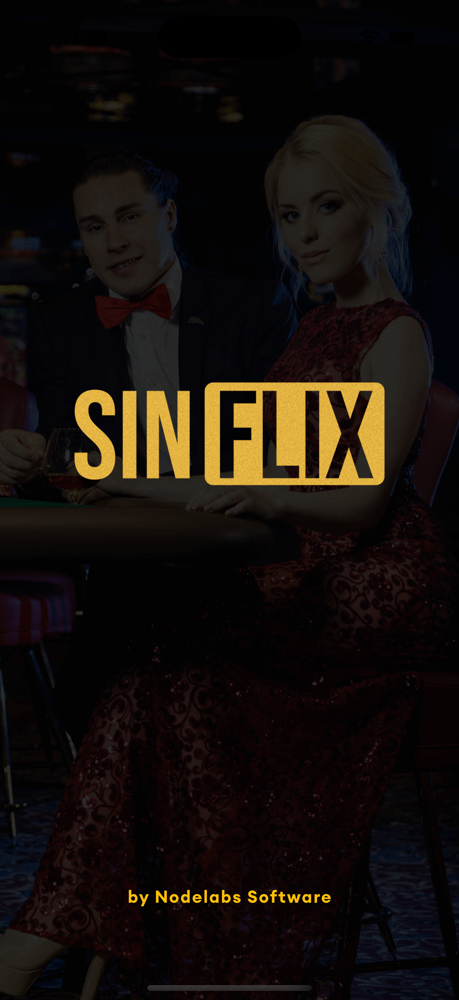
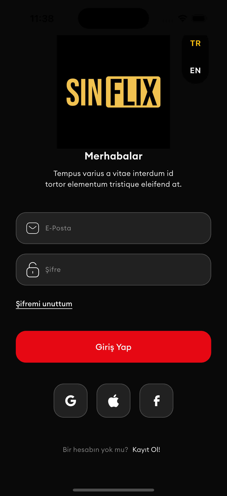
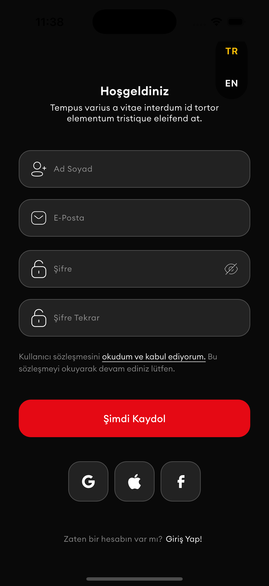
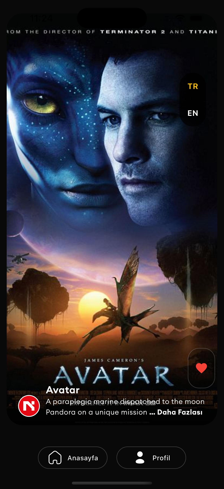
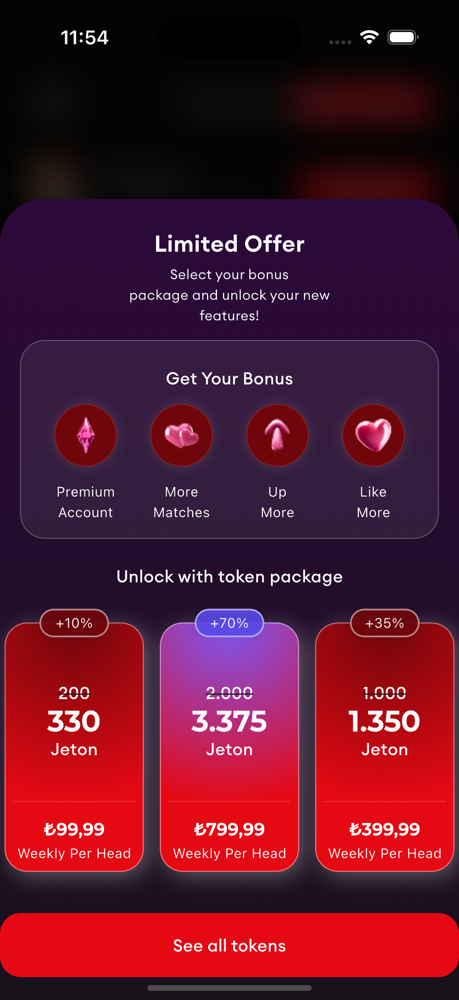
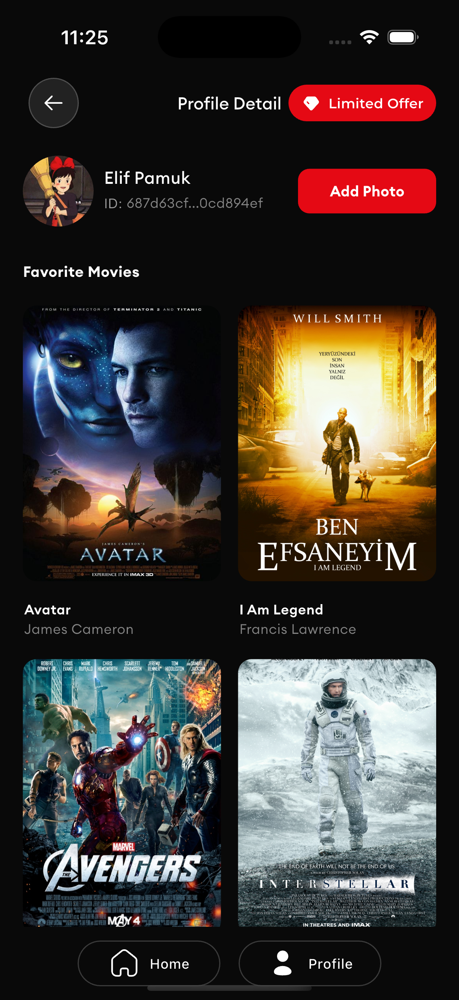
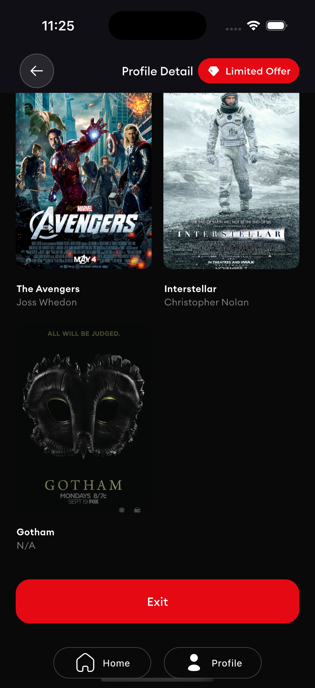
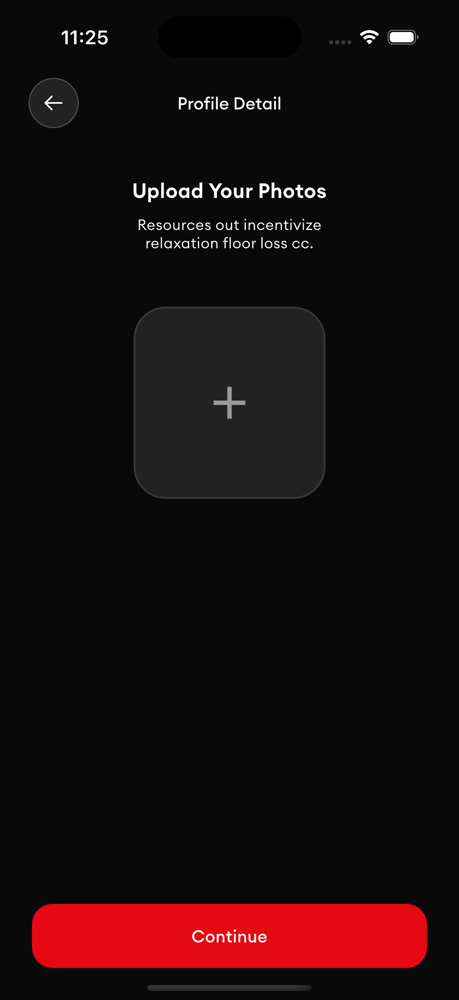

# SinFlix - Flutter Case Study

SinFlix, Nodelabs Software için hazırlanmış bir Flutter case study projesidir. Bu uygulama, film/dizi keşfetme, favorileme, profil ve kimlik doğrulama (login/register) gibi temel özellikleri içerir.

## Uygulama Ekran Görüntüleri

### Splash & Login
 

### Register


### Discover (TR/EN)
 

### Offer / Sınırlı Teklif (TR/EN)
 

### Profil & Favoriler
 

### Fotoğraf Yükleme


## Demo Video

[▶️ Uygulama Kısa Tanıtım Videosu (mp4)](https://drive.google.com/file/d/1Ik9UwpvyMk09ATwquCx7O3hipebJJpQi/view?usp=sharing)

## Proje Özellikleri

- Kullanıcı Girişi & Kayıt (Login/Register)
- Güvenli token yönetimi (Secure Storage)
- Sonsuz scroll (infinite scroll) ile ana sayfa film listesi (5'li)
- Favori filmler (anlık UI güncellemesi, Profile kaydı)
- Profil görüntüleme ve fotoğraf yükleme
- Localization (Türkçe, İngilizce)
- Splash ekranı & özel animasyonlar
- Custom Bottom Navigation Bar
- Sınırlı Teklif Bottom Sheet
- Clean Architecture, MVVM, Bloc kullanımı
- Logger ve Firebase Crashlytics/Analytics
- Responsive ve modern UI (Figma tasarıma yakın)

## Proje Yapısı

```plaintext
lib/
 ├── core/             # Temalar, yardımcılar, servisler, logger, widgets
 ├── features/
 │    ├── auth         # Giriş/kayıt ekranı ve işlemleri
 │    ├── discover     # Keşfet (ana sayfa)
 │    ├── offer        # Sınırlı teklif bottom sheet
 │    ├── profile      # Profil ve fotoğraf işlemleri
 │    └── splash       # Splash ekranı
 ├── l10n/             # Lokalizasyon dosyaları (TR/EN)
 ├── routes/           # Uygulama rotaları (GoRouter)
 └── main.dart         # Uygulama başlangıcı
```

## Kurulum
```plaintext
-git clone https://github.com/elifogreniyor/moviematch_app.git
-cd moviematch_app
-flutter pub get
-flutter run
Not: Firebase servislerini kullanmak için kendi google-services.json ve GoogleService-Info.plist dosyalarınızı eklemelisiniz.
```

## Geliştirici
Elifnur Pamuk
elifnurpamuk1998@gmail.com
